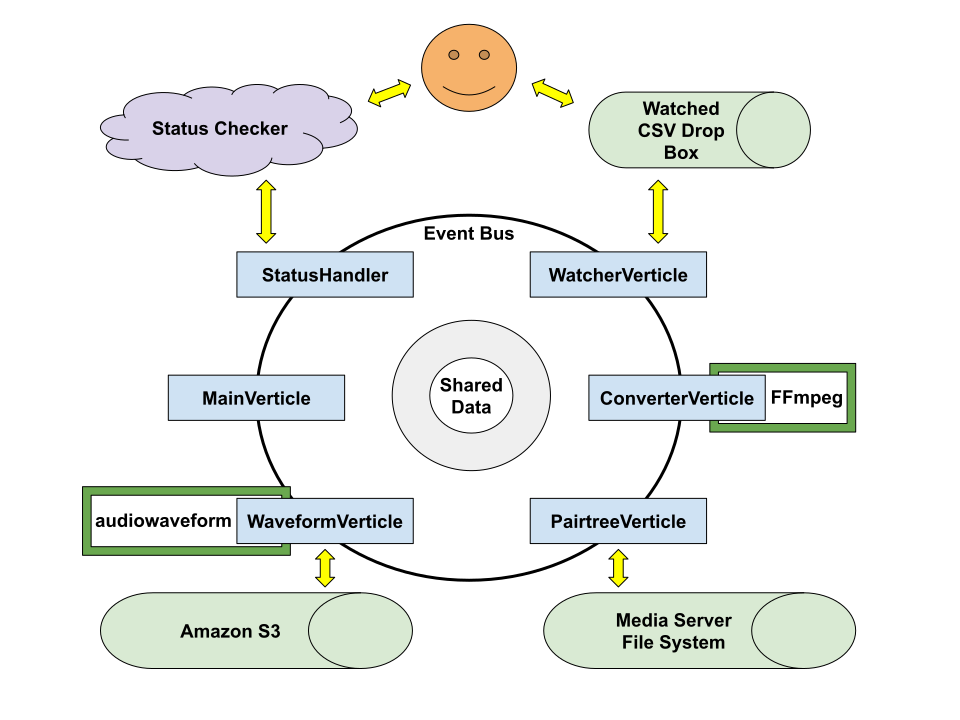
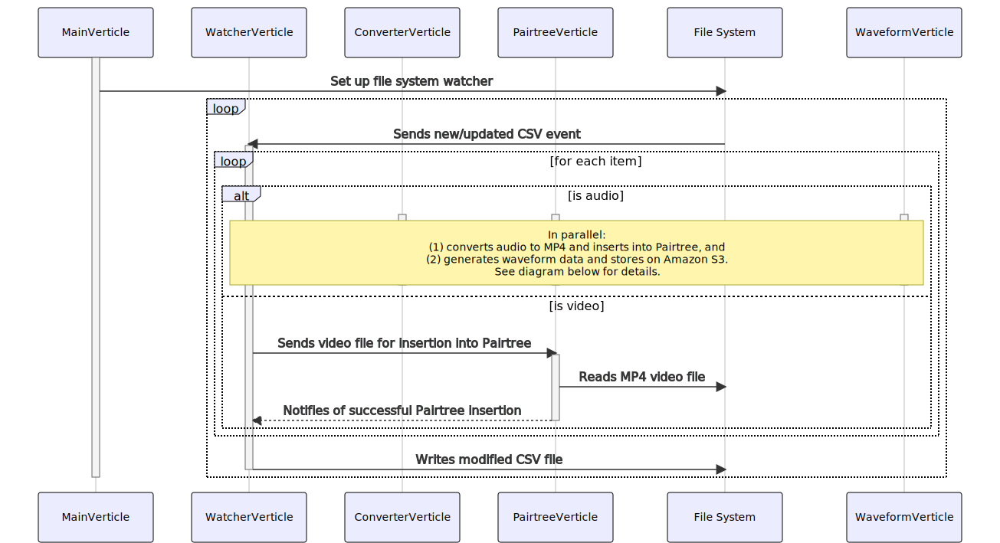

# Architecture

This document describes the high level architecture of the av-pairtree program. If you want to familiarize yourself with the code base, you are in the right place!

## Bird's Eye View

The av-pairtree program is an application that watches a "drop box" for new or updated CSV files with a certain structure. When a CSV file with A/V files has been put into the drop box, the av-pairtree program picks them up and processes their audio and video files.

The processing of video files (which are MP4s by default) involves putting them into a [Pairtree](https://tools.ietf.org/html/draft-kunze-pairtree-01) structure that's accessible to a media server. The processing of audio files (which are WAVs by default) involves two conversions:

  * to MP4 format, the results of which are put into the Pairtree structure; and
  * to binary [audiowaveform](https://github.com/bbc/audiowaveform) format, the results of which are deposited to AWS S3.

After all the A/V files in a CSV file have been processed, the input CSV is updated to include the resources' new access URLs (i.e. the URLs of the media files as served by the media server) and audiowaveform URLs, then written back out to the file system.



## Expected CSV Structure

A CSV file that is going to be processed by av-pairtree should have two required columns: `File Name` and `ItemARK`. The first is used to retrieve the media file to be processed and the second is used to create the Pairtree structure. If the file has been previously processed (or has been processed by the Bucketeer application), it will also have a `IIIF Access URL` column; if previously processed, it may also have a `Waveform` column. That's fine. However, older CSV files may have `iiif_access_url` as a column header. Any CSVs with that column header should be manually updated before processing with av-pairtree.

## Code Map

This section talks briefly about the important directories and data structures of the project.

The av-pairtree project uses the [Vert.x](https://vertx.io/) toolkit and, so, adopts its vocabulary for system components. Vert.x, for those who aren't familiar with it, is an event-driven, reactive toolkit that provides different ways of handling asynchronous events (e.g., callbacks, promises, futures, etc.) It isn't opinionated; as a result, it lends itself well to a wide variety of applications, like this one.

The basic structure of this particular Vert.x program includes: verticles, handlers, the event bus, and a CSV item (i.e., the representation of a CSV row that contains a media file). These are represented in the table below:

| Component | Function | File or HTTP location |
--- | --- | ---
| MainVerticle | This starts up the "drop box" functionality and an HTTP server | [src/main/java/edu/ucla/library/avpairtree/verticles/MainVerticle.java](https://github.com/UCLALibrary/av-pairtree/blob/main/src/main/java/edu/ucla/library/avpairtree/verticles/MainVerticle.java) |
| Verticle(s) | These are lightweight "actors" that handle events sent over the event bus | [src/main/java/edu/ucla/library/avpairtree/verticles](https://github.com/UCLALibrary/av-pairtree/tree/main/src/main/java/edu/ucla/library/avpairtree/verticles) |
| The event bus | This is the message queue that carries events to verticles | https://vertx.io/docs/apidocs/io/vertx/core/eventbus/EventBus.html |
| Handler(s) | These handle incoming HTTP requests (e.g. application status requests) | [src/main/java/edu/ucla/library/avpairtree/handlers](https://github.com/UCLALibrary/av-pairtree/tree/main/src/main/java/edu/ucla/library/avpairtree/handlers) |
| CsvItem | This is an object which represents a single item (or row) from the CSV file | [src/main/java/edu/ucla/library/avpairtree/CsvItem.java](https://github.com/UCLALibrary/av-pairtree/blob/main/src/main/java/edu/ucla/library/avpairtree/CsvItem.java) |
| CsvItemCodec | This codec implements a JSON (de)serialization of CsvItem so that it can be sent over the event bus | [src/main/java/edu/ucla/library/avpairtree/CsvItemCodec.java](https://github.com/UCLALibrary/av-pairtree/blob/main/src/main/java/edu/ucla/library/avpairtree/CsvItemCodec.java) |

Actions (e.g., the parsing of CSV files, conversion of media files, or storage of media files in a Pairtree structure, etc.) are performed by the application's various verticles (e.g., WatcherVerticle, ConverterVerticle, PairtreeVerticle, WaveformVerticle, etc.) Cf. the `verticles` directory for examples.

## Sequence Diagram

The sequence diagram below illustrates the order of events that happen as the av-pairtree program processes an A/V file and puts it into a [Pairtree](https://tools.ietf.org/html/draft-kunze-pairtree-01) directory structure.



A single CSV file might contain both audio and media files, so av-pairtree loops through both processes in the sequence diagram as it parses content from the supplied CSV file. It also loops through CSV submissions, since more than one CSV can be submitted via the drop box.

## Configuration Options

The sample configuration file for the project can be found in the project's test resources directory: `src/test/resources/test-config.properties`. This configuration is also what's used when running the project's tests.

When running av-pairtree in a non-test mode, one needs to supply their own configuration file, as described in the project's `README.md`.

The properties and default values for an av-pairtree configuration file are as follows:

| Property | Description | Default value |
--- | --- | ---
| http.port | The port at which the HTTP server runs | 8888 |
| http.host | The host name used by the HTTP server | 0.0.0.0 |
| csv.dir | The watched directory into which CSV are dropped | N/A |
| source.dir | The root directory for the CSV's media files | N/A |
| output.dir | The place where a collection's Pairtrees are written | N/A |
| pairtree.prefix | The optional Pairtree prefix that should be used when creating Pairtrees | N/A |
| audio.encoding.format | The output audio encoding format | mp4 |
| audio.sampling.rate | The output audio sampling rate | 44100 |
| audio.codec | The audio codec to use inside the encoding wrapper | aac |
| audio.bit.rate | The bit rate used to encoding the audio stream | 128000 |
| audio.channels | The number of channels in the audio stream | 2 |
| audio.encoding.threads | The number of threads to use in audio encoding | 0 (all available) |
| iiif.access.url | The URL pattern into which to insert the Pairtree path | N/A |
| conversion.workers | The number of cores to use for audio file conversion | 2 |
| pairtree.workers | The number of cores to use for pairtree insertion | 2 |
| waveform.workers | The number of cores to use for audiowaveform generation | 2 |

## Documentation

This project has a `README.md` file and an `ARCHITECTURE.md` file (what you're currently reading) in its root directory.

The application also uses OpenAPI and AsyncAPI files to define its public and internal messaging APIs. These can be found in the [`src/main/resources`](https://github.com/UCLALibrary/av-pairtree/tree/main/src/main/resources) directory. The files are `av-pairtree-openapi.yaml` and `av-pairtree-asyncapi.yaml`.

To produce the project's Javadocs of all the classes and their methods, etc., run `mvn javadoc:javadoc` from the root of the project. The output from that can be found on your local machine at `target/site/apidocs`. It's marked up in HTML, so one can use a browser to view it.

## Logging

The application's logging configuration can be found in the [`src/main/resources`](https://github.com/UCLALibrary/av-pairtree/tree/main/src/main/resources) directory. Its file name is `logback.xml`.

The logging configuration file used when running the tests is located in the [`src/test/resources`](https://github.com/UCLALibrary/av-pairtree/tree/main/src/test/resources) directory. Its name is `logback-test.xml`.

Both can be modified to control logging output.

The project uses [Logback](https://logback.qos.ch/) for logging. Information about its [configuration syntax](https://logback.qos.ch/manual/configuration.html) can be found on the Logback website.

## I18N Resources

All messages and logs that the program outputs can be internationalized. This is accomplished through the use of a resource bundle file in the [`src/main/resources`](https://github.com/UCLALibrary/av-pairtree/tree/main/src/main/resources) directory. The file's name is `av-pairtree_messages.xml`. An internationalized version of the file can be created by adding a new file with some addition I18N information in its name (for instance: `av-pairtree_messages_pl_PL.xml` would be a Polish version of the message bundle). 

All text that is added to the file can be accessed by loggers like:

```
private static final Logger LOGGER = LoggerFactory.getLogger(ConverterVerticle.class, MessageCodes.BUNDLE);

public void start() {
  LOGGER.debug(MessageCodes.AVPT_001, getPort()); // Logs startup message with port number
}
```

The message keys from the XML file are translated into a MessageCodes constants class by a Maven plugin that runs as a part of the build. If one wants to run the message code generation independent of the whole build (for instance, after a new message has been added to the bundle), the following can be run from the project's root directory:

`mvn info.freelibrary:freelib-maven-plugins:generate-codes`

This command can also be encapsulated in a shell script that the developer puts at `/usr/local/bin/rb` (so they just need to run `rb` to regenerate the I18N code). This isn't strictly necessary, though, since the code is regenerated as a part of the Maven build.

## Contact Us

We use an internal ticketing system, but we've left GitHub [issues](https://github.com/UCLALibrary/av-pairtree/issues) open in case you'd like to file a ticket or make a suggestion.
